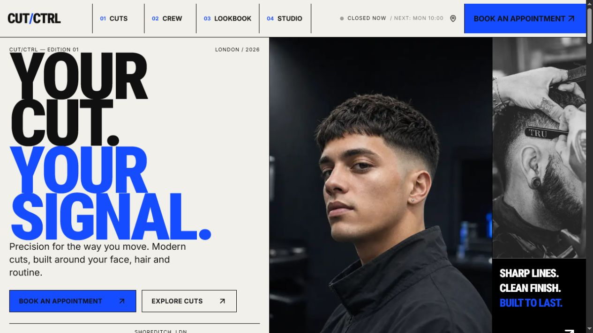
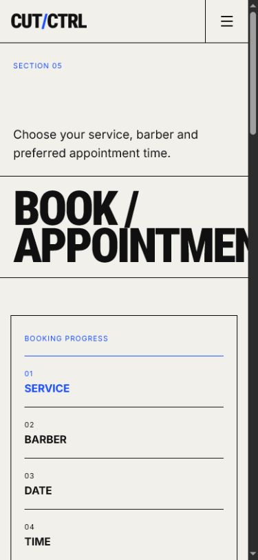

# CUT/CTRL

CUT/CTRL is a concept website for a contemporary barbershop, designed with a bold editorial identity and an interactive, mobile-first booking experience.

> This is a fictional portfolio project. The studio, staff, services, contact details, and appointments shown in the interface are demonstration content.

## Live Demo

The deployed website will be linked here after its first Vercel deployment.

**Live website:** `YOUR_VERCEL_URL`

## Overview

CUT/CTRL explores how an independent barbershop can feel direct, useful, and distinctive online. The experience combines service discovery, haircut guidance, studio information, and a six-step appointment flow in one responsive Next.js application.

### Design concept

The visual system uses a warm off-white canvas, near-black structural lines, and electric blue actions. Condensed display typography, square geometry, asymmetric image crops, and compact utility copy give the site its editorial, street-level character without compromising navigation or booking clarity.

## Key Features

- Responsive editorial interface for mobile and desktop
- Six-step appointment booking with dynamically generated business dates
- Field-level booking validation, loading and error states, and focus management
- Downloadable `.ics` calendar events for confirmed appointments
- Timezone-aware opening status and shared weekly-hours configuration
- Interactive service list and price builder
- Guided haircut recommendation tool
- Before-and-after comparison slider
- Expandable barber profiles
- Filterable lookbook with browser-saved looks and an accessible lightbox
- Animated mobile navigation with Escape handling, focus return, and scroll locking
- Open Graph, Twitter card, sitemap, robots, and LocalBusiness structured data
- Reduced-motion support and responsive `next/image` delivery

## Routes

| Route | Purpose |
| --- | --- |
| `/` | Homepage and main experience overview |
| `/cuts` | Services, recommendations, comparison, and price builder |
| `/crew` | Barber profiles and specialties |
| `/lookbook` | Filterable work gallery and saved looks |
| `/studio` | Studio details, hours, directions, and contact form |
| `/book` | Multi-step appointment booking experience |
| `/robots.txt` | Search-crawler rules |
| `/sitemap.xml` | Generated route sitemap |
| Any unknown route | Custom 404 page |

## Screenshots

### Homepage



### Booking Experience



### Lookbook

A dedicated lookbook screenshot has not been added yet. Capture the `/lookbook` route and save the image as `public/readme/lookbook.png`, then replace this note with the commented Markdown below.

<!--  -->

## Technology Stack

- [Next.js](https://nextjs.org/) with the App Router
- [React](https://react.dev/)
- [TypeScript](https://www.typescriptlang.org/)
- [Tailwind CSS](https://tailwindcss.com/)
- [Framer Motion](https://motion.dev/)
- [Lucide React](https://lucide.dev/)
- Next.js Image and `next/font`
- ESLint with the Next.js configuration

## Local Installation

Node.js and npm are required. Next.js 16 requires Node.js 20.9 or newer.

```bash
git clone https://github.com/jahehye/cut-ctrl.git
cd cut-ctrl
npm install
npm run dev
```

Open [http://localhost:3000](http://localhost:3000) in a browser.

## Environment Configuration

No environment configuration is required to start the project locally. `NEXT_PUBLIC_SITE_URL` is the only environment variable used by the application; it controls canonical metadata, Open Graph URLs, structured data, the sitemap, and robots output.

Copy `.env.example` to `.env.local` when you want those absolute URLs to match a local or deployed environment:

```bash
NEXT_PUBLIC_SITE_URL=http://localhost:3000
```

For production, set the value to the final HTTPS deployment URL without a trailing slash. This variable is public configuration, not a secret.

## Development Commands

```bash
npm run dev        # Start the development server
npm run typecheck  # Check TypeScript without emitting files
npm run lint       # Run ESLint
npm run build      # Create a production build
npm run start      # Serve the completed production build
```

To verify a production build locally:

```bash
npm run build
npm run start
```

## Deploying to Vercel

The repository is prepared for a standard Next.js deployment.

1. Push the project to GitHub.
2. Sign in to [Vercel](https://vercel.com/).
3. Select **Add New > Project** and import this GitHub repository.
4. Confirm that Vercel detects the **Next.js** framework preset.
5. Add `NEXT_PUBLIC_SITE_URL` under **Environment Variables**. For the initial deployment, this can be added after Vercel assigns the project URL, followed by a redeploy.
6. Select **Deploy**.
7. Set `NEXT_PUBLIC_SITE_URL` to the final Vercel or custom-domain URL and redeploy so metadata uses the correct origin.
8. Replace `YOUR_VERCEL_URL` in this README and add the same URL to the GitHub repository website field.

## Project Structure

```text
app/          Application routes, layouts, metadata, sitemap, and robots
components/   Reusable interface and interaction components
config/       Centralized site identity, contact details, hours, and URL
data/         Services, barbers, lookbook entries, and image references
lib/          Business-date and opening-status utilities
public/       Images, screenshots, favicon, and static assets
scripts/      Project runtime helper for the Next.js commands
```

## Customization

| Content | Location |
| --- | --- |
| Site name, description, address, phone, email, map URL, timezone, and social placeholders | `config/site.ts` |
| Weekly opening hours and closed days | `config/site.ts` (`weeklyHours`) |
| Services, prices, durations, barber profiles, lookbook entries, and image references | `data/site.ts` |
| Booking time slots and unavailable times | `components/BookingWizard.tsx` |
| Booking business-day generation and live open/closed calculations | `lib/hours.ts` |
| Global metadata, social cards, and structured data | `app/layout.tsx` and `config/site.ts` |
| Page copy and route-specific sections | Files under `app/` and reusable components under `components/` |
| Photography and social preview image | `public/images/` |
| README screenshots | `public/readme/` |

Update the fictional contact and business information before adapting the project for a real studio.

## Known Limitations

- Booking confirmation is simulated in the browser; no appointment is sent, stored, or reserved.
- The contact form is a demonstration interaction and does not transmit messages.
- There is no database, account system, payment processing, or availability API.
- Booking time slots and one unavailable slot are configured in the client component.
- Saved lookbook items use browser `localStorage` and do not sync across devices.
- Social profiles are clearly marked placeholders and do not link to live accounts.
- All studio and staff information is fictional portfolio content.

## Future Improvements

- Connect bookings and availability to a secure scheduling service.
- Add a real contact delivery endpoint with spam protection.
- Move editable studio content into a CMS.
- Persist saved looks for signed-in customers.
- Add automated interaction and accessibility tests.
- Add the final lookbook screenshot and deployed live-demo link.

## Suggested GitHub Repository Settings

**Description**

> A bold editorial barbershop website built with Next.js, TypeScript, Tailwind CSS, and Framer Motion.

**Suggested topics**

```text
nextjs
typescript
tailwindcss
framer-motion
react
barbershop
portfolio
web-design
frontend
```

**Website**

Add the final Vercel URL to the repository's **About > Website** field after deployment.

## Credits

- Interface concept and implementation created as a frontend portfolio project.
- Display and body fonts are loaded through `next/font`.
- Interface icons are provided by Lucide.
- Included image assets are demonstration content and should be replaced with properly licensed studio photography before production use.

## License

No formal open-source license is currently included. The project is shared for portfolio and educational review. Add an appropriate license before permitting reuse, redistribution, or commercial adaptation.
